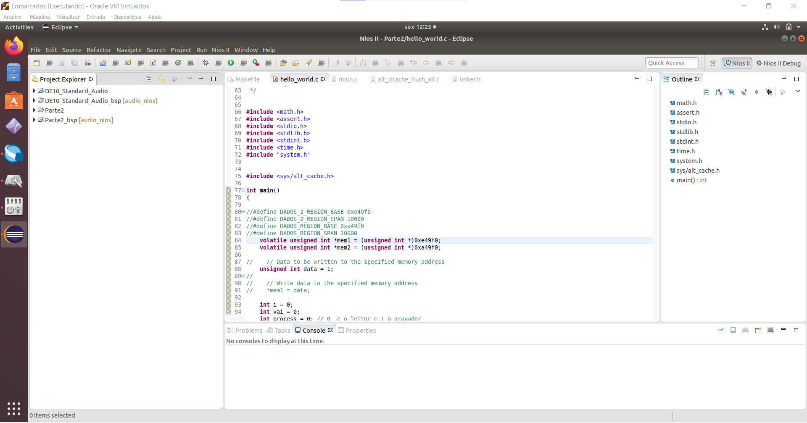
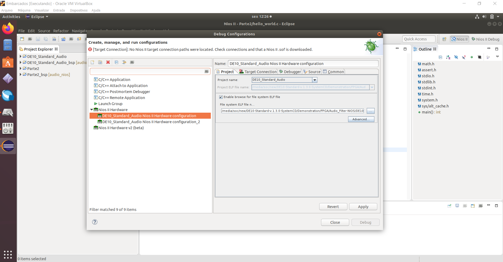
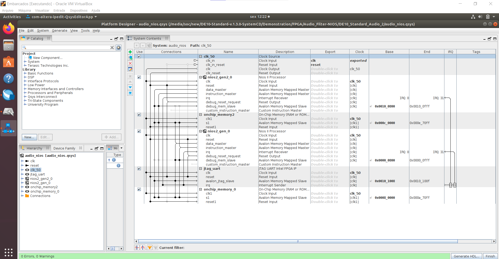
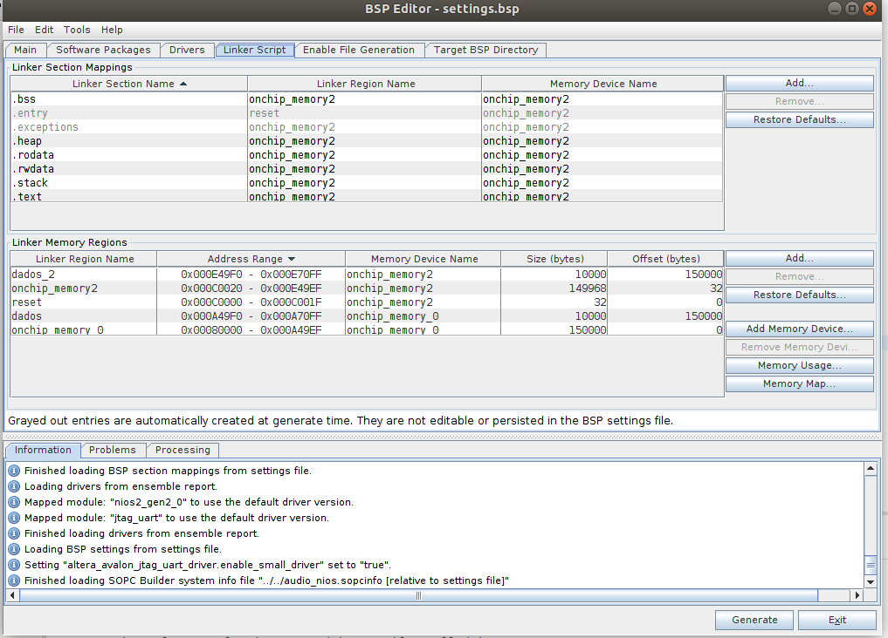
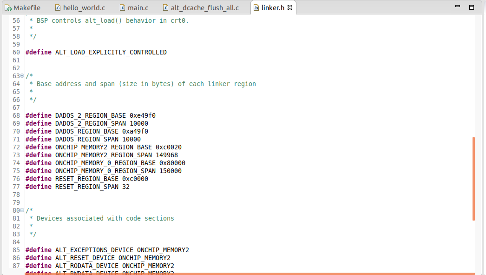
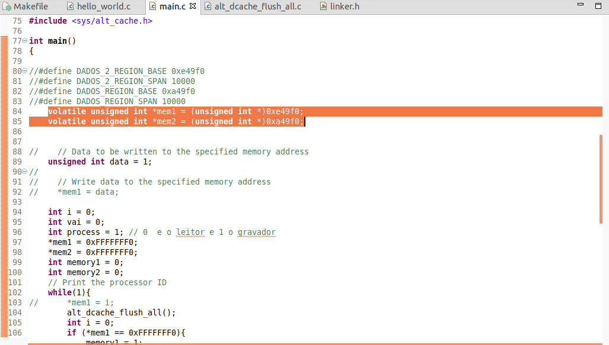
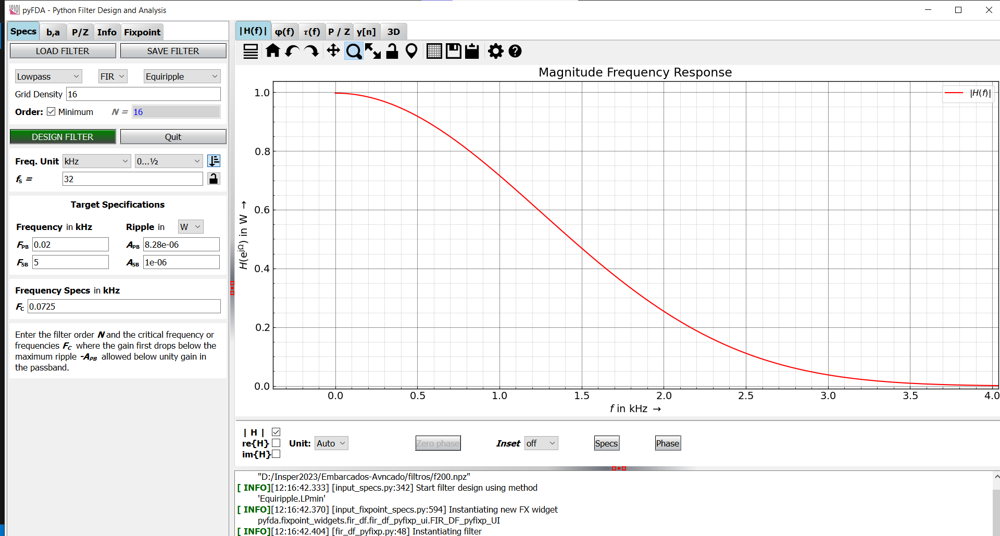

# PING PONG MEMORY NIOS 

## Description
This project is a simple two-NIOS II project that uses two shared memories and only will read and write when the memory is free. The first NIOS II will write FFFFFFFF in the first memory when its done writing the information in all the memory, then the second NIOS II will read the information and write 0xFFFFFFF0 in the first memory when its done reading all the information. The second NIOS II will write FFFFFFFF in the second memory when its done writing the information in all the memory, then the first NIOS II will read the information and write 0xFFFFFFF0 in the second memory when its done reading all the information. This process will repeat until the user stops the program.

## How to use
1. Download the project
2. Open the project in Quartus
3. Compile the project
4. Program the FPGA (maybe you need to change the device -- Auto Detect)
5. Open the NIOS II Software Build Tools for Eclipse
6. Import the project (File -> Import -> General -> Existing Projects into Workspace -> Select root directory -> Browse(DE10_Standard_Audio_2\software) -> Select the projects (DE10_Standard_Audio and Parte2) -> Finish)

7. Compile the project (Project -> Build All)
8. Run as debug (Run -> Debug Configuration -> DE10_Standard_Audio Nios II Hardware configuration) for the first NIOS II 
9. Run as debug (Run -> Debug Configuration  ->DE10_Standard_Audio Nios II Hardware configuration2 ) for the second NIOS II 

10. Watch the Nios II Console for the results, due to the fact we are saving integers in the memory, the numbers will use 4 bytes of memory. So it will write 2500 in each memory and switch.

## How to do in your own project
1. Create a new project
2. Create a 2 NIOS II  and 2 shared memories in platform designer
3. Connect the shared memories to the NIOS II and connect the NIOS II to the JTAG UART as shown in the image below
4. Connect the shared memories to the NIOS II.

5. Compile the project
6. Program the FPGA (maybe you need to change the device -- Auto Detect)
7. Open the NIOS II Software Build Tools for Eclipse
8. Create a new project (File -> New -> NIOS II Application and BSP from Template -> Hello World Nios II Application -> Next -> Finish)
9. Adjust the reserved space for the shared memory in the linker script (BSP -> Linker Script -> memory -> adjust the space for the shared memory)(see the image below for an example "dados" is the name of the shared memory)

10. Create a new project for the second NIOS II  and repeat the steps 1 to 9
11. Get the base address of the shared memories in the linker.h file
12. Write the code in the main.c to write in the shared memory (check the code in the project -- DE10_Standard_Audio_2\software\DE10_Standard_Audio\main.c)
13. Write the code in the main.c to read in the shared memory (check the code in the project -- DE10_Standard_Audio_2\software\Parte2\hello_world.c)
14. Compile the project (Project -> Build All)
15. Run as debug (Run -> Debug Configuration -> DE10_Standard_Audio Nios II Hardware configuration) for the first NIOS II -- remember to select the correct NIOS II and the correct project (ELF File)
16. Run as debug (Run -> Debug Configuration  -> DE10_Standard_Audio Nios II Hardware configuration_2) for the second NIOS II -- remember to select the correct NIOS II and the correct project (ELF File)
17. Watch the Nios II Console for the results, due to the fact we are saving integers in the memory, the numbers will use 4 bytes of memory. So it will write until 2500 in each memory. You can change the number of bytes that you want to write in the memory in the main.c file using short int, int, long int, etc.

## changes that you need to do in the code
1. Change the base address of the shared memory using the one in the linker.h file. (WARNING: Dont change the base address of the shared memory in the linker.h file, just see and change the value in the main.c file -- 0xe49f0 and 0xa49f0 in all the places)

2. Change the number of bytes that you want to write in the memory in the main.c file using short int, int, long int, etc.
3. Change the number of bytes that you want to read in the memory in the main.c file using short int, int, long int, etc.
4. Change the size of the memory in the linker script and in the main.c file (calculate by doing the base address of the memory + the size of the memory in hexa)

# Using this in a real project example
This project was motivated when using the DE10-Standard board and the DE10-Standard Audio project. The DE10-Standard Audio project records the audio in the memory and then plays the audio from the memory. The problem is that i wanted to implement FIR filters in the audio, but the audio was being played while the FIR filter was being calculated. So i needed more time to calculate the FIR filter. So this project was created to solve this, the first NIOS II will record the audio in the memory and the second NIOS II will play the audio from the memory. The second NIOS II will only play the audio when the memory is full. So the first NIOS II will play the audio from the memory and the second NIOS II will calculate the FIR filter. This way the audio will not sutters while the FIR filter is being calculated.
In the DE10-Standard Audio project in this repository you can see the FIR filter being implemented in a NIOS II and the audio being played while doing the FIR filter. The problem is that the PING PONG MEMORY NIOS project is not implemented in the DE10-Standard Audio project, so the audio will sutters if more than one FIR filter is implemented.

## How to use in the DE10-Standard Audio project
1. Download the project
2. Open the project in Quartus
3. Compile the project
4. Program the FPGA (maybe you need to change the device -- Auto Detect)
5. Open the NIOS II Software Build Tools for Eclipse
6. Import the project (File -> Import -> General -> Existing Projects into Workspace -> Select root directory -> Browse(DE10_Standard_Audio\software) -> Select the projects (DE10_Standard_Audio) -> Finish)
7. Compile the project (Project -> Build All)
8. Run as (Run -> Run As -> Nios II Hardware)
9. To see the results of the filter is necessary to print the output of the filter in the NIOS II Console. Tha you can paste the OUTPUT on a program like excel and see the results in a graph. To print the results, uncomment the lines (516 - 521) in the main.c file (DE10_Standard_Audio\software\DE10_Standard_Audio\main.c)

## FIR filter
A FIR filter is a filter that uses the previous inputs to calculate the output. The FIR filter is calculated by doing the sum of the previous inputs multiplied by the coefficients. In the project is used a FIR filter that cuts the frequencies above 400 hz, the coeficients were calculated using pyfda. The FIR filter is calculated in the function convolve in the main.c file (DE10_Standard_Audio\software\DE10_Standard_Audio\main.c).

#### Example of a FIR filter of 400 hz